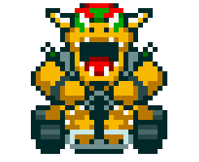

# Super Mario Corrida 🏁

Este é um projeto desenvolvido para a DIO (Digital Innovation One), simulando uma corrida divertida entre personagens clássicos do universo Mario, rodando diretamente no terminal!

## Como funciona o jogo?

- Dois jogadores escolhem seus personagens favoritos.
- A cada rodada, uma fase é sorteada aleatoriamente: **reta**, **curva** ou **confronto**.
- Cada fase utiliza um atributo diferente dos personagens (velocidade, manobrabilidade ou poder) somado ao resultado de um dado.
- Quem tiver o maior valor vence a rodada e ganha 1 ponto.
- O primeiro a atingir 3 pontos vence o campeonato!

## Personagens e Gifs

| Personagem    | Gif |
|--------------|-----|
| Mario        |  |
| Luigi        |  |
| Bowser       |  |
| Peach        |  |
| Yoshi        |  |
| Donkey Kong  |  |

## Atributos dos Personagens

| Personagem    | Velocidade | Manobrabilidade | Poder |
|--------------|:----------:|:---------------:|:-----:|
| Mario        |     4      |        3        |   3   |
| Luigi        |     3      |        4        |   4   |
| Bowser       |     5      |        2        |   5   |
| Peach        |     3      |        5        |   2   |
| Yoshi        |     2      |        4        |   3   |
| Donkey Kong  |     2      |        2        |   5   |

- **Velocidade**: usada nas fases de reta 🛣️
- **Manobrabilidade**: usada nas curvas 🌀
- **Poder**: usada nos confrontos ⚡

---
# aviso ao felipão

sinceramente, ao desenvolver meu codigo  eu não achei interessate a feauture de no confronto se perder pontos invés de ganhar, então como eu mesmo fiz meu codigo e minha logica eu resolvi tirar, provalemnete ela foi usada com o intuito pedagogico de fazer os alunos do curso verificarem se um numero é menor que 0 e tratarem essa incognita, e para uso pédagogico realmente entendo que é legal, mas optei por fazer da minha forma. A programação não tem apenas uma maneira de pensar então acho que você vai me entender 💖
---

# screenshots 📸


e o yoshi levou a melhor nessa ksskksk quem apostou nele ?

---
## Como rodar o projeto

1. Certifique-se de ter o [Node.js](https://nodejs.org/) instalado.
2. Baixe ou clone este repositório.
3. No terminal, navegue até a pasta do projeto:
   ```bash
   cd super-mario
   ```
4. Execute o jogo:
   ```bash
   node index.js
   ```
5. Siga as instruções na tela para escolher os personagens e se divertir!

## Dica de diversão

Chame um amigo, apostem quem será o campeão e vejam quem tem mais sorte (ou estratégia) nas corridas do Mario! 🎲🏆

---
Projeto criado para fins educacionais na DIO. 
